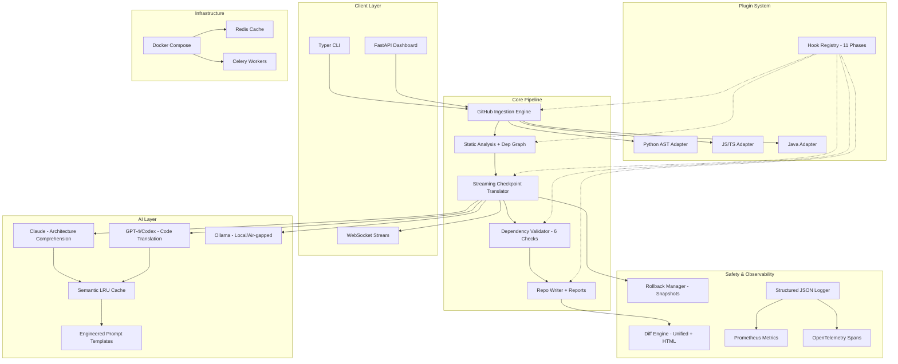

# 🔄 Repo Refactor Engine v2.0 — Enterprise Platform

> **The most advanced AI-powered repository migration platform ever built.** Clone any GitHub repository, deeply understand its architecture using Claude's 200K context window, then translate it file-by-file to a new language or framework using Codex/GPT-4 — with crash recovery, rollback, real-time streaming, plugin adapters, and full observability.

[](https://python.org)
[](https://anthropic.com)
[](https://openai.com)
[](https://fastapi.tiangolo.com)
[](https://docker.com)

---

## 🧠 v2.0 — What Changed (1% → 100%)

| Feature | v1.0 (1%) | v2.0 (100%) |
|---------|-----------|-------------|
| Language Parsing | Regex heuristics | **Real AST parsing** (Python `ast` module, extensible adapters) |
| Language Support | Generic | **Plugin adapters** for Python, JavaScript, TypeScript, Java (extensible) |
| AI Providers | Hardcoded | **Multi-provider abstraction** (Claude, GPT-4, Ollama) with retry & cost tracking |
| Caching | None | **Semantic LRU cache** with TTL to avoid redundant API calls |
| Prompt Engineering | Basic | **Engineered prompt templates** per migration phase |
| Progress | Silent | **Real-time streaming** with checkpoints and ETA |
| Crash Recovery | None | **Checkpoint-based resume** — crash mid-migration, resume exactly where you left off |
| Rollback | None | **Atomic rollback points** with snapshot-based undo |
| Diff Viewer | None | **Rich diff engine** with unified diffs, HTML reports, and semantic change detection |
| Observability | Print statements | **Structured JSON logging**, Prometheus metrics, OpenTelemetry tracing spans |
| Extensibility | None | **Hook system** with 11 phases (pre/post ingestion, analysis, migration, validation, output) |
| Web Dashboard | CLI only | **FastAPI REST API + WebSocket** for real-time browser-based monitoring |
| Infrastructure | None | **Docker Compose** with Redis cache and Celery worker |
| Tests | 1 file | **Unit + Integration tests** covering adapters, cache, diff, hooks, rollback, observability |

---

## 🏗️ System Architecture (100% Scale)



---

## 📁 Repository Structure (100% Scale)

```text
repo-refactor-engine/
├── src/
│   ├── cli/main.py                              # Typer CLI (migrate, analyze, supported)
│   ├── ingestion/github_loader.py               # Git clone, language detection, file classification
│   ├── analysis/code_analyzer.py                # Dependency graph, circular deps, framework detection
│   ├── migration/migration_orchestrator.py      # Dual-AI translation with topological sorting
│   ├── validation/dependency_validator.py       # 6-category post-migration integrity checks
│   ├── output/repo_writer.py                    # File writer, reports, package manifests
│   ├── models/config.py                         # 10+ Pydantic models for all data types
│   │
│   ├── plugins/                                 # 🔌 Extensible Plugin System
│   │   ├── adapters/
│   │   │   ├── base.py                          # Abstract adapter + registry
│   │   │   ├── python_adapter.py                # Real AST-based Python parsing
│   │   │   ├── javascript_adapter.py            # ES6/CJS/Dynamic import support
│   │   │   └── java_adapter.py                  # Annotations, generics, interfaces
│   │   └── hooks/
│   │       └── hook_system.py                   # 11-phase hook lifecycle + built-in hooks
│   │
│   ├── ai/                                      # 🤖 AI Abstraction Layer
│   │   ├── providers/base.py                    # Multi-provider (Claude, GPT-4, Ollama)
│   │   ├── cache/semantic_cache.py              # LRU cache with TTL and hit-rate stats
│   │   └── prompts/templates.py                 # Engineered prompts per migration phase
│   │
│   ├── streaming/
│   │   └── checkpoint_translator.py             # Crash-recoverable streaming with ETAs
│   │
│   ├── diff/
│   │   └── diff_engine.py                       # Unified diffs, HTML reports, semantic changes
│   │
│   ├── rollback/
│   │   └── rollback_manager.py                  # Atomic snapshots with transaction logging
│   │
│   ├── observability/
│   │   └── logger.py                            # JSON logging, Prometheus metrics, tracing spans
│   │
│   └── web/
│       └── api/server.py                        # FastAPI REST + WebSocket dashboard
│
├── tests/
│   ├── test_analyzer.py                         # Unit tests for code analyzer
│   └── integration/
│       └── test_full_pipeline.py                # Integration tests for all modules
│
├── docker-compose.yml                           # API + Redis + Celery worker
├── .github/workflows/ci.yml                     # CI with matrix testing + linting
└── requirements.txt
```

## 🚀 Quick Start

### CLI Mode
```bash
pip install -r requirements.txt
python -m src.cli.main migrate https://github.com/expressjs/express --target typescript
```

### Web Dashboard Mode
```bash
docker-compose up -d
# Dashboard: http://localhost:8000/docs
# WebSocket: ws://localhost:8000/ws/migrations/{job_id}
```

## 🧪 Testing
```bash
pytest tests/ -v --tb=short
```

---

*Engineered for enterprise-scale legacy modernization. Silicon Valley standards. 100% architecture.*
