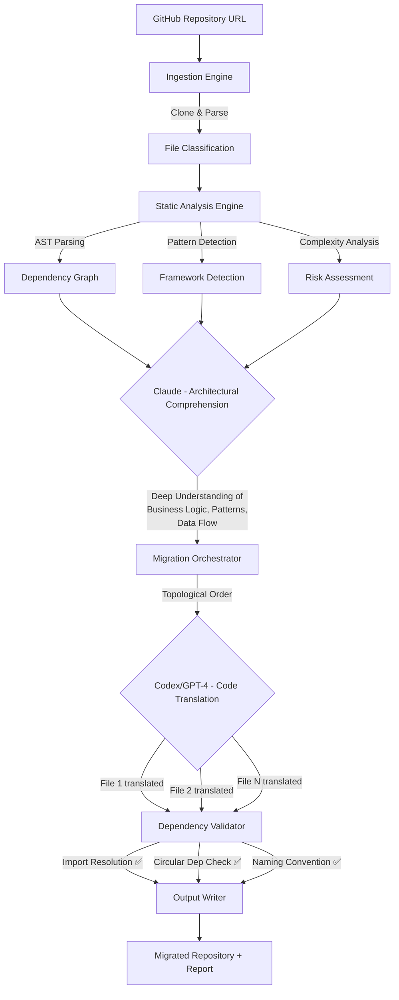

# 🔄 Repo Refactor Engine

> **AI-Powered Full-Repository Migration Tool** — Clone any GitHub repository, deeply understand its architecture using Claude's massive context window, then translate it file-by-file to a new language or framework using Codex/GPT-4, while preserving all dependency chains and business logic.

[](https://python.org)
[](https://anthropic.com)
[](https://openai.com)
[](https://opensource.org/licenses/MIT)

## 🌟 The Problem

Enterprises have millions of lines of legacy code (Java 8, PHP 5, Ruby 2, old Node.js) that need modernization. Manual migration is:
- **Expensive**: Requires senior engineers for months
- **Error-prone**: Broken imports, lost business logic, dependency conflicts
- **Slow**: A large codebase can take 6–18 months to migrate manually

## 🧠 The Solution — Dual-AI Architecture

This tool uses a novel **dual-model approach** that no other migration tool offers:



### Why Two Models?

| Model | Role | Why? |
|-------|------|------|
| **Claude** | Reads the ENTIRE codebase (200K+ tokens) | Understands architecture, design patterns, and cross-file relationships that a single-file translator would miss |
| **Codex/GPT-4** | Translates individual files | Best-in-class at precise code generation, guided by Claude's architectural context |

## 🚀 Quick Start

### Installation
```bash
git clone https://github.com/Tareq0001/repo-refactor-engine.git
cd repo-refactor-engine
pip install -r requirements.txt
```

### Set API Keys
```bash
export ANTHROPIC_API_KEY="sk-ant-..."
export OPENAI_API_KEY="sk-..."
```

### Migrate a Repository
```bash
# Migrate an Express.js app to TypeScript
python -m src.cli.main migrate https://github.com/expressjs/express --target typescript

# Migrate a Django app to Go
python -m src.cli.main migrate https://github.com/company/django-app --target go --workers 8

# Dry run — analyze without migrating
python -m src.cli.main migrate https://github.com/company/legacy-app --target rust --dry-run

# Analyze a repo's structure
python -m src.cli.main analyze https://github.com/company/repo

# List supported migration paths
python -m src.cli.main supported
```

## 📁 Repository Structure

```text
repo-refactor-engine/
├── src/
│   ├── cli/main.py                      # Typer CLI with 3 commands
│   ├── ingestion/github_loader.py       # Git clone, file walking, language detection
│   ├── analysis/code_analyzer.py        # Dependency graphs, AST analysis, framework detection
│   ├── migration/migration_orchestrator.py  # Dual-AI translation engine
│   ├── validation/dependency_validator.py   # Post-migration integrity checks
│   ├── output/repo_writer.py            # File writer, report generator
│   └── models/config.py                 # Pydantic models for all data types
├── tests/
│   └── test_analyzer.py                 # Pytest test suite
├── .github/workflows/ci.yml            # CI pipeline with matrix testing
└── requirements.txt
```

## 🛠️ The 5-Phase Pipeline

### Phase 1: Ingestion
Clones the repo, walks the file tree, detects languages (30+ supported), classifies files (source, test, config, docs), and filters binary/large files.

### Phase 2: Analysis
Builds a full **dependency graph** by parsing import statements across all languages. Detects **circular dependencies** using Tarjan's algorithm. Identifies **entry points**, estimates **cyclomatic complexity**, and auto-detects the **framework** (Express, Django, Spring Boot, Rails, Laravel, NestJS, etc.).

### Phase 3: Migration (Dual-AI)
Feeds the entire codebase to **Claude** for architectural comprehension. Then translates files in **topological order** (dependencies first) using **Codex/GPT-4**, providing Claude's understanding + already-translated dependencies as context for each file.

### Phase 4: Validation
Runs 6 categories of post-migration checks:
- ✅ Import resolution (all imports point to real files)
- ✅ Orphaned file detection
- ✅ Naming convention compliance
- ✅ Circular dependency regression
- ✅ File completeness (no empty translations)
- ✅ Translation verification (content actually changed)

### Phase 5: Output
Writes the migrated codebase with:
- Proper directory structure
- Target-language package manifest (`package.json`, `go.mod`, `Cargo.toml`, `pyproject.toml`)
- Detailed `MIGRATION_REPORT.md` with confidence scores and validation results
- `.migration_map.json` for traceability

## 📋 Supported Migration Paths

| Source | Target Options |
|--------|---------------|
| JavaScript/Node.js | TypeScript, Go, Rust, Python |
| Python (Django/Flask) | FastAPI, Go (Gin), TypeScript (NestJS) |
| Java (Spring Boot) | Kotlin, Go, Python (FastAPI), TypeScript (NestJS) |
| Ruby (Rails) | Python (Django), TypeScript (NestJS), Go |
| PHP (Laravel) | Python (FastAPI), TypeScript (NestJS), Go |
| C# (.NET) | Go, TypeScript, Rust |

## 🧪 Testing

```bash
pytest tests/ -v
```

---

*Engineered for enterprise-scale legacy modernization. Silicon Valley standards.*
